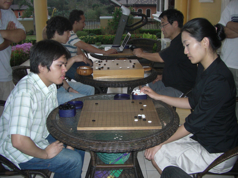

# Crushed in 77 moves

    
Posted on February 09, 2009

    
Posted in Uncategorized

PGA had some Korean insei visitors last Sunday. I was able to play against Ms Lee Seunghyun, a commentator on Baduk TV. It was an honor to play against her. The game was quite embarrassing, but I’ve learned a lot, thanks to her patience and for giving a great review (she was a commentator after all).

    

When I went home, I was able to record my game against Ms Lee, including all the variations discussed during the review. And I remembered all that because I was crushed in only 77 moves. Here’s the game:

[LeeSeunghyun-vs-Mikong.sgf](../sgf/LeeSeunghyun-vs-Mikong.sgf)

#### Comments:

Jean Paul (Wed, 11 Feb 2009 07:22:10 UTC):
> Malupit pala itong nakalaban mo no…ang lakas pumatay!

mikong (Wed, 11 Feb 2009 16:11:21 UTC):
> Malupit talaga, hehe
