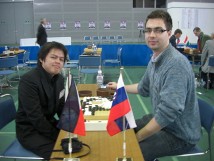

# 30th WAGC Game Review: Philippines vs Slovenia

    
Posted on June 04, 2009

    
Posted in Uncategorized

My round 4 game in the 30th World Amateur Go Championship was against Timotej Suc 3-dan from Slovenia. I got crushed in the game. But Timotej kindly reviewed our game for me and showed me where I made a mistake.

    

I knew where I made a mistake thanks to his review, but I wanted to know how to attack white’s group better. So I requested for a professional to review the game. The game was reviewed by Yamada Noriyoshi 9-dan professional. I only recorded the SGF when I got back from Japan and it has been several days since the review so I may have missed some variations, or made some mistakes. Here’s the game:

[30th_wagc-phils_slovenia.sgf](../sgf/30th_wagc-phils_slovenia.sgf)
