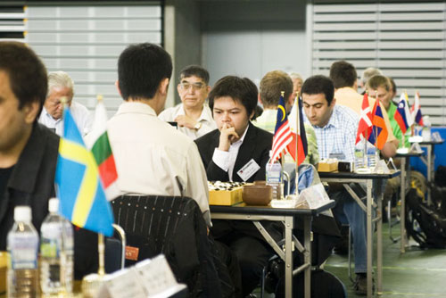

# Attending the 30th World Amateur Go Championship

    
Posted on June 04, 2009

    
Posted in Uncategorized

I just came back from Japan after participating as the Philippine representative in the 30th World Amateur Go Championship in Shizouka, Japan. It was my first time to participate in an international Go tournament, and its the most fun I had in a long time!

The first thing I’m quite impressed is the number of languages that the players knew. Most can speak English and their national language, but some can speak more. Like the Thailand’s Paisal knowing Thai, English and Mandarin, or Malaysia’s Boon Ping knowing Malay, English, Mandarin, and Cantonese (although some consider Cantonese as a dialect), or Czech speaking fluent English and Nihongo (and I’d guess he’d know Czech as well). So most can speak 2 with some speaking 3 or even 4 languages. Amazing!

From rounds 1-8 I played against Malaysia, Belgium, Bulgaria, Slovenia, Ireland, Guatemala, Uruguay, and Switzerland. I only won against Bulgaria and Guatemala, and lost terribly to the rest except my game with Ireland where the game was pretty close. I’ll be posting some articles in this blog for some of the games with reviews by Go professionals or a former yeongusaeng.

I’m really surprised and very happy with how much game reviews I’ve observed during the event, not just of my own games but also of other players. It was great that the 8 and 9-dan professionals who refereed the tournament reviewed the games even for lower ranked players such as myself. O’Rissei was the chief referee and I saw him review a game or two. Michael Redmond 9-dan was a guest in the event and he also reviewed some games.

I’m thankful to referees Yamada Noriyoshi 9-dan pro and Takanashi Seiken 8-dan pro for reviewing my games; Jan Ramon of Belgium who patiently reviewed my game against him even though he had some disability with his eyesight; Slovenia’s Timotej Suc for also reviewing our game; UK’s Matt Cocke for reviewing my game with Ireland’s Brian Gallagher and Min Sung Suh from KABA for reviewing my game with Switzerland’s Dominik Mueller; players from Mongolia, Turkey, Vietnam, Thailand, and Uruguay also gave me some lessons; the organizers and the locals for giving inspiration, providing really good food, for the translations, and for the gifts (japanese traditional paper fan, chocolate coated biscuits, go books, green tea, japanese traditional toy, 4 Seasons of Fukuroi coffee table book, candies, a cool pen, etc).

Also, I had great fun conversations and dinner company with players Thailand and Malaysia; India, Nepal and Turkey; Uruguay, Korea, Min Sung Suh from KABA, Canada, Mexico, Argentina, US and Colombia.

Some stories I’ll remember…

Paisal went to Beijing to study Go and Mandarin for a little over a year. He studied in Nie Weiping’s Go School (currently number 1 Go school in China).

Min Sung Suh told me some stories about his study in Bacolod, Philippines and how he knows how to speak some Ilonggo and Tagalog words/phrases. He said he’s friends with Ms Lee and Mr Hong who visited PGA a few months ago.

Edgardo from Guatemala described the origin of my name. He gave me a traditional Japanese bowl/cup and a souvenir Guatemala currency bill. He also carved the Mayan calendar system on a japanese bamboo. Pretty cool guy.

Totoro-fan Mario from Costa Rica said he’s friends with my fellow Go player in the Philippines Cherisse. He thinks One Piece is lame (I strongly disagree with that), and overall is a crazy guy. hehehe

Eric from US, Juyong from Canada and Emil from Mexico shared some stories about the US Go Congress. Eric could identify players in KGS by their opening, so we asked about the identities of some of the popular KGS players.

Yuka, one of the Japanese locals, taught Nihongo for 3 years in Davao City, Philippines (the same city where I studied my high school), until she got married and went back home to Japan. I hope she gets to visit the Philippines with her husband in the future.

Some of the Japanese locals told me that I should study more and get stronger and have a better score next time. I forgot to ask their names, but I have their pictures. I hope I get to see them again and maybe play Go with them when I’ve become stronger.

I look forward to participating in more international Go events!

#### Comments:

dangs (Thu, 04 Jun 2009 09:39:55 UTC):
> Wow! It’s great to hear you enjoyed you trip. Feel ko happiness mo :) yay!

Lochinvar (Thu, 04 Jun 2009 11:44:35 UTC):
> Go Mike!:) haha, i agree with Dangs: nice pic:)
>
> can the Philippines host an international Go event?

mikong (Thu, 04 Jun 2009 12:04:49 UTC):
> Thanks dangs!
>
> Mike, magaling lng kasi ung photographer, hehehe
>
> I don’t think we can host an international Go event just yet. The Go community here is still quite small, and doesn’t have any money. Although, the 2007 SEA games had Go as an exhibition sport, and the upcoming 2010 Asian games will also have Go. So maybe the next time SEA games or Asian games is hosted in our country, then that’s like hosting an international Go event too :)
