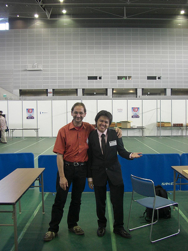

# 30th WAGC Game Review: Philippines vs Switzerland

    
Posted on June 06, 2009

    
Posted in Uncategorized

My round 8 game may have been the most interesting game for me. Dominik Mueller, my opponent from Switzerland, used some very interesting opening moves which includes a tengen move for Black’s 3rd move. Once again, I had a very good opening, but ended up losing coz of some bad moves in the middle game. I resigned late in the game.

    

As Dominik and I started reviewing the game, we were having trouble judging some moves. Mr. Min Sung Suh from the Korean Amateur Baduk Association (and formerly a Korean insei or yeongusaeng) was very kind to have offered to review the game for us after he noticed our problem. The following is the review as far as I could remember (recorded in SGF some days after the actual review, so may be inaccurate):

[30th_wagc-phils_switzerland.sgf](../sgf/30th_wagc-phils_switzerland.sgf)

In this tournament, I realized I was quite good in the opening, but severely lacks the skill in the middle game (particularly fighting). This was my last game in the tournament, and I was hoping I could get my 3rd win. But I didn’t, even with a very good opening. I was a bit disappointed soon after the game, but the disappointment quickly faded. I had a really great time and I found myself smiling a lot after even though I had a score of only 2 out of 8 rounds. I’ve learned so much. The games, even the ones I’ve lost, were very enjoyable. And I met so many people. I can’t wait to participate in more international tournaments.

#### Comments:

Ryan Tani (Mon, 10 Aug 2009 11:49:05 UTC):
> Well, when it comes to being well-dressed, you owned all of them 😉 Hikaru no Mikong! Err, Mikong no Go!
