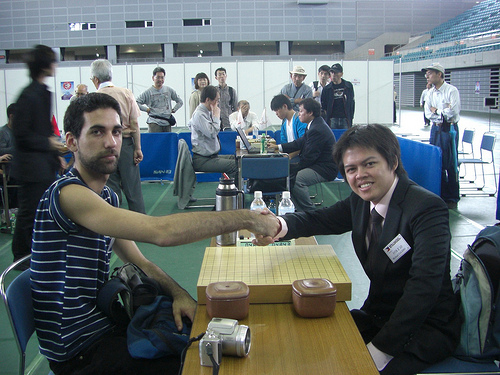

# 30th WAGC Game Review: Philippines vs Uruguay

    
Posted on June 06, 2009

    
Posted in Uncategorized

My round 7 game was against Martin Benenati Michelena 3-dan from Uruguay. I lost by a lot of points (over 50). After the game, he said he’ll just take a 15-minute break and then we’ll go on to have our game reviewed by a professional. That was a surprise, as it’s usually the player who lost who’s more interested in having the game reviewed. I guess he saw how much I wanted it reviewed, since I lost by so much and all.

    

Here’s the review by Yamada Noriyoshi 9-dan professional (note that the sgf was created several days after the review so it may contain some mistakes):

[30th_wagc-phils_uruguay.sgf](../sgf/30th_wagc-phils_uruguay.sgf)

We’ve actually played Go once before at the hallway of Business Hotel Gen where we were staying. It was kind of a blitz game, and I lost early in that game. He reviewed the game for me then. Then, when he found out we were playing for round 7, he was quite happy coz he knew he’s much stronger than me. But I told him I wouldn’t make it so easy for him to win our game. But after losing over 50 points in the official game, it shows I wasn’t able to make it a difficult game. Maybe next time, it’ll be a closer game. I hope to play with him again in the future.
