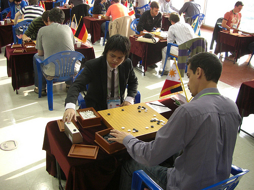

# 4th Korea Prime Minister Cup

    
Posted on November 02, 2009

    
Posted in Uncategorized

I have just participated in the 4th Korea Prime Minister Cup that was held on October 23-27 in Jeonju City, S. Korea. 68 countries participated in this amateur Go tournament.

    

The resulting top 5 countries are:

1. Korea
2. China
3. Hong Kong
4. China
5. USA

It was quite a tough tournament for everyone due to the compressed schedule. We played 3 games on the first day of the tournament, and 4 games on the second day. The time allotted for each player is only 30 minutes each (with 3 x 30 sec byo yomi for overtime). By the second day, I was making some awful careless mistakes and my opponents also made bad ones. You know that the games are not going so well when the lead shifts from one player to the other not because of good moves but because of simple reading mistakes. But it was even tougher for the other players. My plane ride took only 3 hours, but for some it took 20 hours. Some had to transfer flights with 4 hours of waiting time in-between or had to stay overnight in another country. Rahul from India had to take a flight to Dubai (to the opposite direction) before going to Korea.

I won only 2 of the 7 rounds in this tournament and was ranked 60th. I hoped I could win 3 games and get a better rank than my result in the 30th WAGC (I was 57th). I’m stronger now than I was during the 30th WAGC, but then other players probably got stronger as well. Officially, I played against Slovenia (5dan), Morocco (3kyu), Norway (4dan), Malaysia (4dan), Uruguay (1dan), Ireland (2kyu), and Venezuela (1dan).

I got some new books as souvenir from the event, particularly interesting was The Master of Haengma by Sung-Ho Baek. I also bought 2 books: Jungsuk in our Time and Korean Style of Baduk 1.

On Oct 26th, we toured around Jeonju City’s famous sites like the [Jeondong Catholic Church][church] and [Gyeonggi-jeon Shrine][shrine]. We ate [bibimbap][bibimbap] for which Jeonju is famous for (I wonder how it differs from other bibimbaps). We prepared a traditional aroma pouch, and glued colorful paper on the sides of a plain box and got them as souvenirs. We also got to participate in the simultaneous games by professionals. I got to play against a 6-dan pro with 8-handicap stones and won!

[church]: http://images.google.com/images?hl=en&source=hp&q=jeondong+church&gbv=2&aq=f&oq=&aqi=
[shrine]: http://images.google.com/images?hl=en&source=hp&q=gyeonggi-jeon&gbv=2&aq=f&oq=&aqi=
[bibimbap]: http://images.google.com/images?hl=en&source=hp&q=bibimbap&gbv=2&aq=f&oq=&aqi=

But the great thing about the event is not just the beauty of the place, but the great company. Here are some stories about the people I’ve met:

On the 3-hour bus ride to Jeonju, I had great conversations with Shavit Fragman about Israel, growing the Go community there (thanks for the tips!), pilgrimage, his son’s Bar Mitzvah and [the Wailing Wall](http://en.wikipedia.org/wiki/Western_Wall). During breaks in the tournament, I got to hang out with Amir Fragman, the representative from Israel and was the youngest participant and a strong 5-dan. He helped review one of my games.

My friend Martin Sacramento attended as a guest official in the event and was my roommate. He helped take pictures for me when I was playing my official games. When we were late for one of the dinners, we had a mini-adventure where we walked around Jeonju City looking for a good dining place, and ended up eating in a place where the owner/staff didn’t speak English and so we had to resort to fake sign language. Before our trip back to the airport, Martin was invited by Jia Cheng Tan (Singapore representative) and Kim Chiong Kwa (Asian Go Federation official from Singapore) to participate in Singapore’s tournaments since Martin will be staying there for a while.

[Xinwen](http://xinwengolife.wordpress.com/), Sharen, [Jayden](http://yclife.wordpress.com/category/go-baduk-related/go-in-korea/) (player and officials from Brunei) and Handy (official from Indonesia) were just fun people to be with. They know each other so well that they seemed like childhood friends and were unrestrained and open, so it didn’t seem like I was with people I’ve only met for the first time. Btw, Jayden has the coolest photos of the event:

* [4th KPMC Day 1](http://www.flickr.com/photos/jaydensia/sets/72157622524728077/)
* [4th KPMC Participants](http://www.flickr.com/photos/jaydensia/sets/72157622678958076/)
* [4th KPMC Day 2](http://www.flickr.com/photos/jaydensia/sets/72157622682639358/)
* [4th KPMC Day 3](http://www.flickr.com/photos/jaydensia/sets/72157622568111007/)
* [4th KPMC Day 4](http://www.flickr.com/photos/jaydensia/sets/72157622691258136/)

I played against Mehdi Araki of Morocco in an official match. We reviewed the game after. He missed a double atari during the end game so I killed a group of stones, but it was funny how he was relieved to know that it wasn’t the cause of his loss. When he took a cigarette break, I accompanied him and we just talked about web app ideas and future plans.

Rahul Jayaraman of India became a good friend during the event. It was funny how before the last round we were kidding around about how it would be nice to be matched against the 6dan players with the same score so far (2 wins) so that we won’t feel so bad about losing lol. During my last night in Korea, Martin, Rahul and I went to Home Plus together to buy gifts/souvenirs for home. On our way back to the hotel, we met Mamy from Madagascar, Mehdi, and Vit Brunner. [Vit Brunner](http://blog.tasuki.org/) told some interesting bits about his stay in [King’s Baduk Center](http://senseis.xmp.net/?KingsBadukCenter) which made me consider studying there instead of China.

After my official game with Zaid from Malaysia, he reviewed our game which I lost quite early. The review of my official game with Ignacio from Uruguay was also interesting because we have about the same level but very different style of playing. He turned out to be a fellow Rails web developer just like me, and we even had a discussion about programming languages with the other players during one lunch time. Btw, there are a lot of software developers in the event, along with teachers, mathematicians, and students.

I met Felipe from Brazil when I accompanied Ignacio during lunch. He talked about how he made friends with one of the translators and his future plans in staying in Korea. We never played in an official match, but he played a teaching game with me one night. Some strong players joined in and gave in some ideas. Later, [Ms. Lee](2009-02-09-crushed-in-77-moves.md) together with Song Hongsuk (the tournament winner) taught some new Korean joseki that’s not even published in any of the books and some that’s still being studied. They also shared some insanely difficult life and death problems.

I met Min Sung Suh before in the 30th WAGC and this time he was one of the organizers. He introduced me to his girlfriend Rihanna (her English name). He played a teaching game with me as well.

Martin, Carlos from Mexico and I talked during our bus trip back to the airport. Carlos talked about watching a TV show about the weirdest food from different countries and saw the episode on the Philippines. He also shared some of the weirdest food they eat in Mexico. I remembered when I met Emil from Mexico in the 30th WAGC and he talked about becoming strong because he just played against a much stronger player than he was but he didn’t mention his name. It turned out to be Carlos.

And these are just some of the stories of the people I met in the 4th KPMC. There are other people I met and I hope to see them again in future Go events wherever that may be. Here are [some photos](http://www.flickr.com/photos/michaelgalero/sets/72157622693500348/) though I suggest you check out the links to Jayden Sia’s photos above.

#### Comments:

Jayden (Mon, 02 Nov 2009 14:22:11 UTC):
> wow. what an interesting post with links. You’ve met a lot of people, nice. I sensed that all the talk about technologies and programming must be interesting. keep it up!
