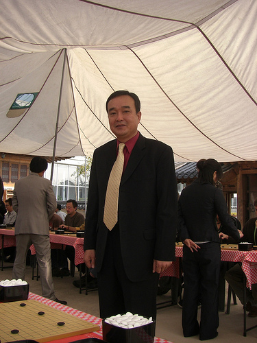
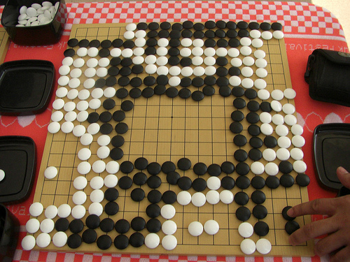

# 4th KPMC Pro Simul Game

    
Posted on November 03, 2009

    
Posted in Uncategorized

In the 4th day of the 4th KPMC, I played against a 6-dan pro in the Simultaneous Games against Professionals event. It was a good thing I got there early because they only offered a limited number of seats.

    

They asked for our ranks. I said I was 1-dan, then they asked me to put 8-handicap stones. They introduced the professionals, and they were then assigned amateur players to play with. As you can see in the photo above, the professional assigned to me is dressed really well. When we (his opponents) were about to take pictures of him, he kindly posed for each camera. When some players finished early, other players immediately filled the seat to start a new game against this pro. I don’t think that was really planned by the organizers but the pro didn’t mind and played against them as well. He was really nice and accommodating.

The Game

I took photos of the board position every once in a while so I could record this game after, and tried my best to put the moves in its proper order. Here’s our game:

[4th_kpmc_pro_simul.sgf](../sgf/4th_kpmc_pro_simul.sgf)

Counting

    

I won by 29.5 points! But then again it was 8 handicap stones, and the professional played against multiple players. Obviously these professionals didn’t play seriously. I think I’ll get crushed even with 9 handicap stones if they were. Amir, the representative from Israel, suggested that next time I should play with at most 6 handicap stones so that the game would involve fighting and not just me playing safe. I’d love to do that next time but I probably need to study more.
