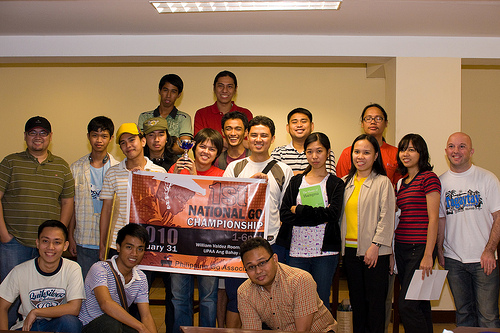

# PGA’s 2010 National Go Championship

    
Posted on March 05, 2010

    
Posted in tournament

    

Last January 31, 2010, the Philippine Go Association organized the 2010 National Go Championship to determine the National Go Champion and representative for the upcoming 31st World Amateur Go Championship in China. I was fortunate to win this tournament.

Here are some great photos taken by my friends [Arland](http://www.flickr.com/photos/arland/sets/72157623202595267) and [Kristine](http://www.facebook.com/album.php?aid=141813&id=648604138).

And here are the [tournament details](http://www.phgo.org/2010-national-go-championship) (rules, prizes, table of results).
